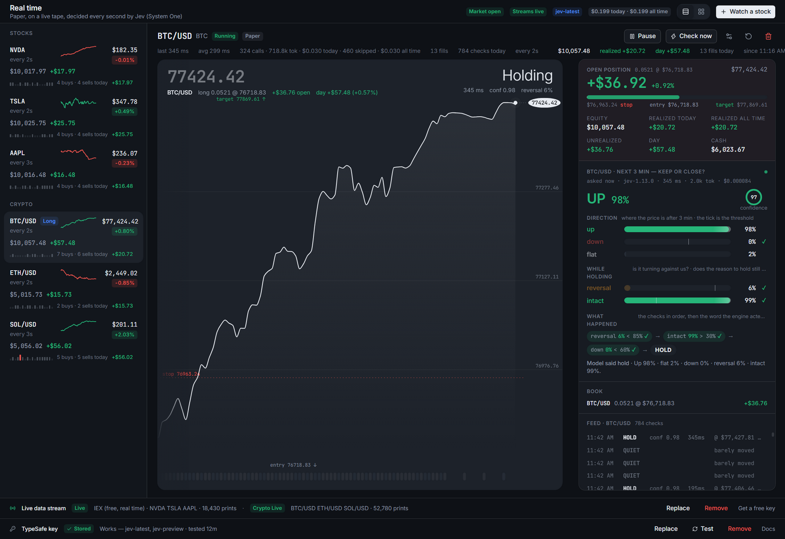
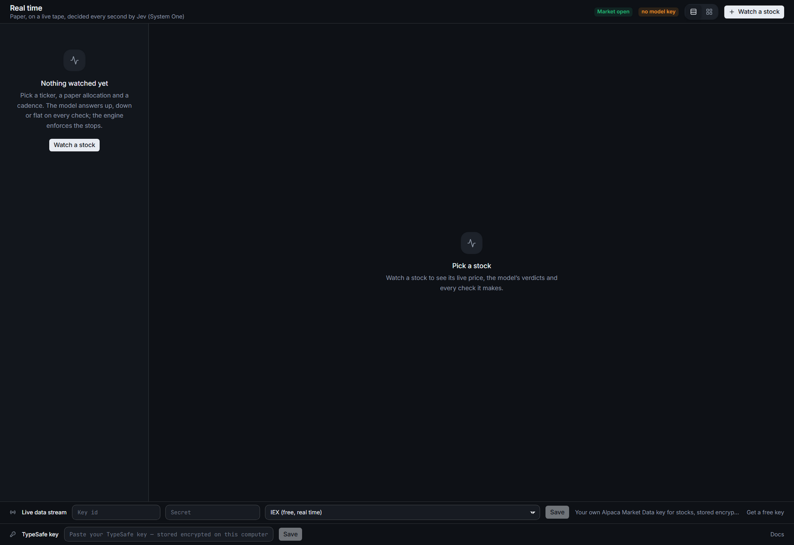
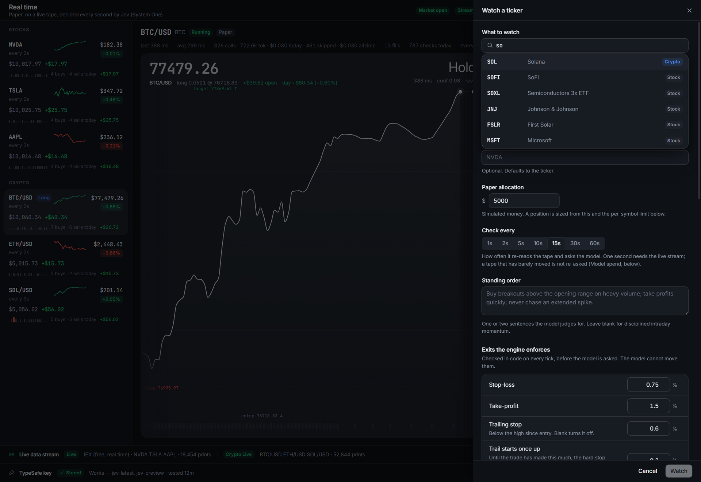
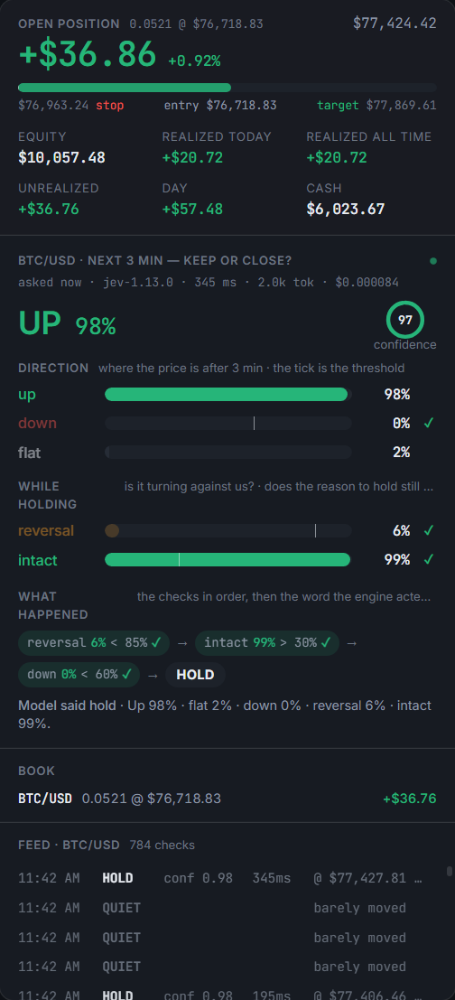
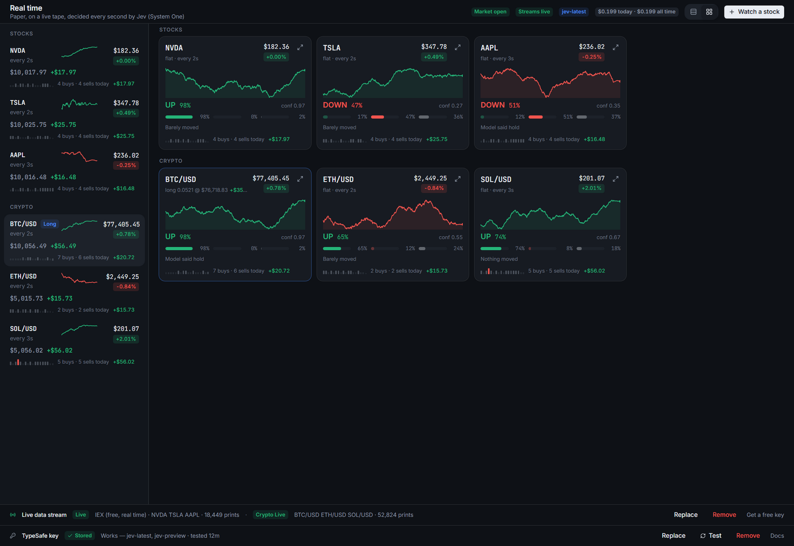

# Jev Realtime

**Paper-trading agents that watch a live market and decide every second.** Pick a stock or a coin, give it some paper money, and watch an AI model read the tape and call up, down or flat, while the app enforces your stops and targets and books every trade. The model is [TypeSafe's Jev](https://docs.typesafe.ai/).

It's a desktop app for Windows and macOS. It never touches real money.



<sub>Screenshots are from a simulated session, for illustration. They are not real or back-tested results.</sub>

## Get it running

### 1. Download

You need [Node.js](https://nodejs.org/) (version 22 is best; 20.19 or newer works) and [Git](https://git-scm.com/).

```bash
git clone https://github.com/rthomas24/jev-realtime-trading.git
cd jev-realtime-trading
npm install
```

No Git? Click **Code → Download ZIP** on GitHub, unzip it, open a terminal in the folder, and run `npm install`.

### 2. Get your keys

| Key | What it's for | Where to get it | Cost |
| --- | --- | --- | --- |
| **TypeSafe** (required) | The model that makes the calls | [console.typesafe.ai → API keys](https://console.typesafe.ai/settings/keys) | Pay as you go. A few cents an hour per agent. |
| **Alpaca** (stocks only) | Live US stock prices | Sign up free at [alpaca.markets](https://alpaca.markets/), open the paper-trading dashboard and generate an API key (a Key ID and a Secret) | Free (IEX data) |

**Crypto needs no key at all.** Prices come from Coinbase's public feed, so you can try the app with just a TypeSafe key.

### 3. Run it

```bash
npm run dev
```

The app opens empty. Paste your keys into the two rows at the bottom. They're stored encrypted on this computer and go nowhere except the service they belong to.



### 4. Watch something

Click **Watch a stock**. Tap one of the popular tickers, or type a name or symbol. Choose how much paper money it gets and how often it checks (every second to every minute), then click **Watch**.



That's it. The agent starts trading paper money straight away: during market hours for stocks, around the clock for crypto.

## Reading the screen



**Top: the money, live.** The open trade's profit, the bar from **stop** to **target** with your entry marked, and six numbers: equity, realized today, realized all time, unrealized, day and cash. They move with every price tick, not just when the model answers.

**Middle: what the model said.** The headline is its call on the next three minutes (UP / DOWN / FLAT) with a confidence ring. Below it, one bar per question it was asked. The thin mark on each bar is your threshold, and ✓ or ✗ shows whether the answer let the trade through.

**Bottom: what happened.** The checks in the order the engine applied them, ending in what it actually did. It reads as a sentence, for example `reversal 6% < 85% ✓ → intact 99% > 30% ✓ → down 0% < 60% ✓ → HOLD`. Under that is the feed: every check, with its latency, token cost and result.

The watchlist on the left shows what each agent is worth and how much it has made since it started. The strip of little bars under each row is its recent checks: green is a buy, red is a sell, amber is a refusal. **Drag rows to reorder them.**

<br clear="right">

### See everything at once

The grid button in the top bar lays every agent out as a tile, each with its chart, its latest call and today's trades. Tiles drag into the same order as the list. Double-click a tile to open it.



## How it decides

The model never places a trade on its own. It answers narrow questions, and code turns the answers into orders under your rules:

| Question | Asked when | The rule in code |
| --- | --- | --- |
| Where is the price in 3 minutes: up, down or flat? | always | buy at P(up) ≥ 70%; close at P(down) ≥ 60% |
| Is the move already over (would buying be chasing)? | not holding | refuse at ≥ 60% |
| How clean is the setup? | not holding | needs ≥ 1.0 on a scale of 0 to 2 |
| Is this symbol trending today, or chopping? | not holding | needs ≥ 0.8 on a scale of 0 to 2 |
| Would this repeat an entry that already failed today? | not holding | refuse at ≥ 60% |
| Is it sharply reversing against the position? | holding | close at ≥ 85%, at any time |
| Is the reason for the trade still intact? | holding | close at ≤ 30% |

Some things the model is never asked about. **Stops, targets and the trailing stop run in code on every tick**, and a trade gets room to work: the model can't close a position in its first 45 seconds, and it has to want out on two checks in a row. Every threshold is a field in the agent's settings.

To keep costs down, the model is only asked again once the price has actually moved (0.02% by default) or 10 seconds have passed. The same situation gets the same answer, so on a calm tape most checks cost nothing. Each agent's row shows its calls, tokens and dollars spent.

**Crypto** trades around the clock, with no opening bell and no end-of-day close. Sale proceeds are available immediately, and prices come keyless from Coinbase's public feed. **Stocks** trade the regular session only, close out by 3:55 PM ET, and settle the next day like a cash account.

<details>
<summary><b>What the model is shown</b></summary>

Every check sends one description of the market, and every question is asked about it at once. All the numbers are worked out in code first and written as plain facts, because the model reads numbers as text and isn't good at comparing them:

- **The tape:** the last trade and how old it is, the best bid and ask, the moves over the last ten seconds, minute and five minutes, who is buying and who is selling, and how busy it is.
- **The bars and the trend:** recent moves, the shape of the last few candles, volume against normal, the opening range, the daily trend and RSI.
- **The position:** how long it has been held, what it's worth, the high since entry, and where the stop and target sit.
- **The book:** its size, how much is in use, and how the day is going.
- **What it already did here today:** every closed trade, how long it lasted and how it ended, plus how its own earlier calls turned out.

</details>

## Other commands

```bash
npm run check      # the engine's checks, run against a scripted model
npm run typecheck
npm run dist:win   # build a Windows installer into dist/
npm run dist:mac   # build a macOS app into dist/
```

For contributors: `src/shared` holds the rules and types, `src/core` the engine (describe → ask → decide → book), `src/main` the Electron host and key storage, `src/renderer` the interface, and `scripts` the checks.

## Not advice, and paper only

This is an experiment. It simulates fills at real prices and never places an order anywhere: no exchange, no wallet, no broker. Nothing it does or says is investment advice. Stock data comes from your own Alpaca key under Alpaca's terms, crypto data from Coinbase's public market data under Coinbase's terms, and model answers from your own TypeSafe key under TypeSafe's terms.

## License

MIT. See [LICENSE](LICENSE).
